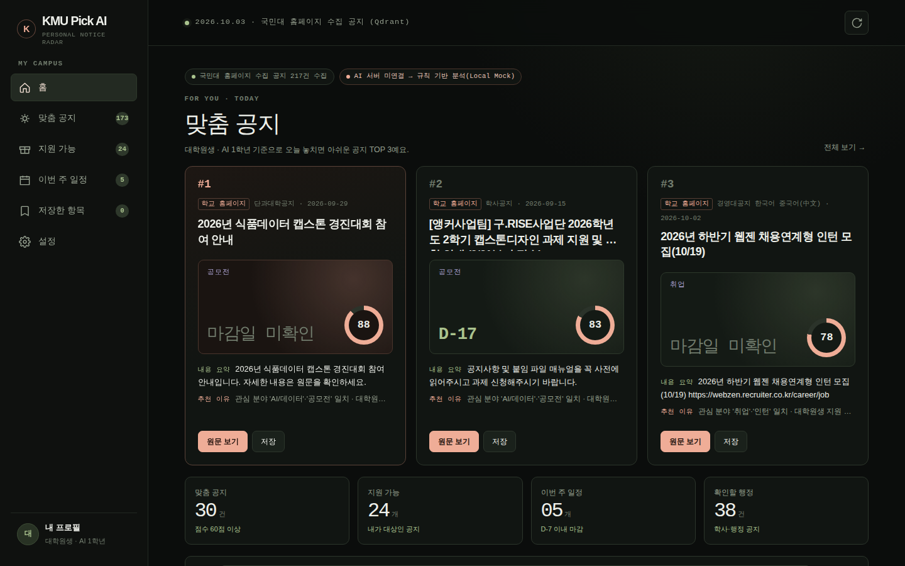
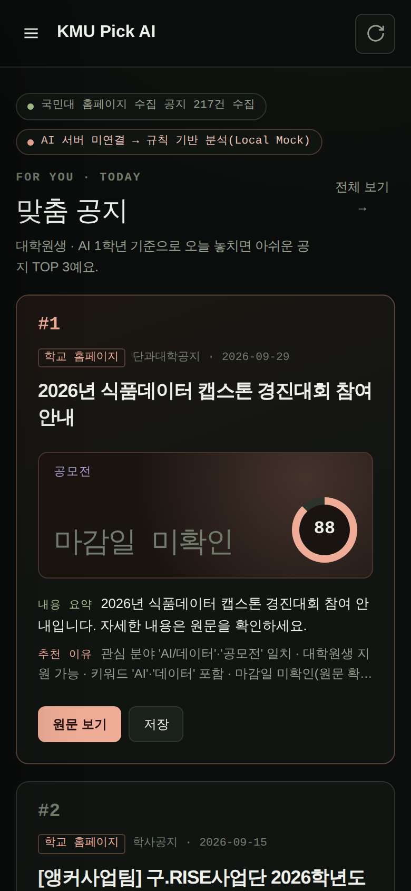

# NoE

## 메인 화면





## 접속 정보

| 서비스 | 주소 | 비고 |
| --- | --- | --- |
| Front (Next.js) | http://14.36.30.189:3001/ | |
| Backend (Node.js) | http://14.36.30.189:3001/api/* | 프론트가 프록시. 직접 접근은 서버 로컬 `127.0.0.1:8001`만 |
| Qdrant REST API | http://14.36.30.189:13000 | 대시보드: http://14.36.30.189:13000/dashboard |
| Qdrant REST API (내부망) | http://192.168.0.236:6333 | 외부 13000 → 서버 3000 → 컨테이너 6333 |
| Qdrant gRPC (내부망) | 192.168.0.236:6334 | 외부 미개방 |

Qdrant 요청 시 `api-key` 헤더에 API 키가 필요합니다. 키는 서버의 `.env` 파일 `QDRANT_API_KEY` 값을 사용하세요 (저장소에는 커밋하지 않음).

## 실행

```bash
docker compose up -d --build
```
