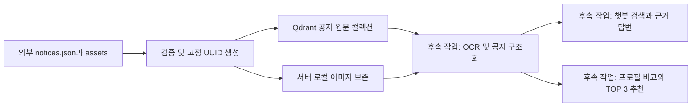

# KMU Pick AI 공지 데이터와 DB 개발 명세

이 문서는 팀원과 AI 개발 도구가 같은 데이터 계약을 기준으로 공지 조회, AI 챗봇, 개인화 TOP 3 추천을 개발하기 위한 기준입니다. 현재 구현된 원문 저장 구조와 후속 개발 제안을 구분합니다. 기준일은 2026년 10월 3일입니다.

**초기 적재에서는 원격 Qdrant에 공지 원문 217건을 저장했고, 전 건을 다시 조회해 저장 payload가 입력 변환 결과와 일치함을 확인했습니다.** 지원 대상·마감·요약 분석, OCR, 임베딩 검색과 화면 연결은 아직 구현되지 않았습니다.


## 추가 JSON 업데이트 결과

`kmu-notices.json` 226건을 기준으로 기존 143건 갱신, 신규 72건 추가를 수행했습니다. 반영한 215건의 payload를 다시 조회해 검증했고 최종 공지는 289건입니다. 메뉴 제목만 확보된 신규 9건, 장식 이미지를 제외하면 내용이 없는 1건, 추출 실패 1건은 반영하지 않았습니다. 기존 공지를 삭제하지 않았습니다.

```bash
cd backend
npm run update:notices -- /path/to/kmu-notices.json
npm run update:notices -- /path/to/kmu-notices.json --write
```

기본 실행은 DB를 읽어 업데이트 계획만 확인합니다. 최초 importer의 dry-run과 달리 DB 연결이 필요합니다. 이 업데이트 어댑터는 articleId와 URL 문자열 이미지 배열을 현재 저장 형식으로 변환합니다. 정규화 원문 URL로 기존 point를 찾고 기존 ID와 로컬 에셋 경로를 유지합니다. 메뉴로 잘못 수집된 제목은 기존 제목을 유지하며, 비어 있거나 기존 본문의 70% 미만인 새 본문은 기존 본문을 보존합니다. 이 길이 기준은 해당 수집 결과의 품질 저하 방지를 위한 보수적인 규칙이므로, 실제로 본문이 짧게 수정된 공지는 수동 검토가 필요합니다.

사이트 공통 리소스 이미지와 경영대 소개 PDF는 공지 에셋에서 제외하고 excludedAssetReferences에 보존합니다. 반영 전 DB 데이터, 입력 JSON, 검증 보고서는 backend/storage/updates에 기록됩니다. 이 폴더는 Git에 포함하지 않습니다. 이번 보고서는 `9afe9ebbd69c127f-report.json`입니다.

## 데이터 규모와 추가 수집 제안

2026년 10월 3일 업데이트 후 원문 공지는 289건입니다. 텍스트 본문 230건, 이미지 중심 59건이며 전부 `analysisStatus: pending`입니다. OCR 필요 공지 223건, 첨부 추출 필요 공지 95건은 서로 중복될 수 있습니다.

약 300건이면 기존 LLM을 사용하는 검색·추천 데모 개발을 시작할 수 있습니다. 이는 자체 모델 학습 데이터 수에 대한 기준이 아닙니다. 먼저 일부 공지의 대상·마감 추출과 근거 답변을 검증하고 수집 범위를 확대하는 것을 제안합니다. 총량 외에 관심 분야별·학과별 공지와 아직 유효한 모집 공지가 충분한지 확인해야 합니다.

추가 수집은 학사공지 외 별도 장학·취업·인턴·특강·행사 게시판, 공지가 적은 사회과학대학(1건)·체육대학(4건)·공과대학(7건), 최근 공지와 여전히 유효한 고정 공지를 우선 대상으로 제안합니다. 숫자를 채우기 위해 중복·메뉴·이미지 미처리 데이터를 정상 공지로 계산하지 않습니다.

## 1. 구현 상태와 데이터 범위

저장 검증 시각: 2026-10-03 05:06:02 UTC, 한국 시간 14:06:02. 아래 수치는 이 시점의 검증 결과이며 실시간 통계가 아닙니다.

| 항목 | 건수 | 의미 |
| --- | ---: | --- |
| 저장 및 payload 일치 확인 | 217 | 공지 원문 전체 |
| 텍스트 본문 확보 | 152 | 텍스트가 있어도 이미지·첨부에 추가 조건이 있을 수 있음 |
| 이미지 중심 공지 | 65 | OCR 없이 상세 내용을 확정할 수 없음 |
| OCR 필요 공지 | 159 | 텍스트 공지 중 미처리 이미지가 있는 항목도 포함 |
| 첨부 텍스트 추출 필요 공지 | 59 | OCR 필요 건수와 중복될 수 있음 |
| 사용 불가 이미지 참조 | 3 | 작성자 PC의 file URL |
| 보존한 로컬 이미지 파일 | 14 | 공지 건수가 아닌 고유 파일 수 |

외부 수집 결과는 15개 대학을 조사했지만 실제 공지는 10개 대학에서 확보했습니다. 수집 보고서 기준 성공 3개, 부분 성공 7개, 실패 5개입니다. 실패 출처는 사회과학대학·법과대학·공과대학·체육대학·미래융합대학이며, 보고서에는 해당 수집 도구에 대한 robots 제한으로 요청을 중단했다고 기록되어 있습니다. 이 출처의 데이터가 없다고 해서 학교에 공지가 없다는 뜻은 아닙니다. 부분 성공 대학도 최신 공지 전체를 확보했다고 보장하지 않습니다.

근거 파일은 수집 패키지의 `crawl-report.json`과 로컬 저장 검증 결과 `backend/storage/import-report.json`입니다. 원본 패키지와 storage 파일은 Git에 포함하지 않았으므로 다른 개발 환경에는 별도 전달이 필요합니다.

## 2. 데이터 흐름



DB 저장 코드는 크롤러와 독립된 CLI입니다. 현재 크롤러의 실행이나 `/api/notices` 요청이 이 컬렉션에 자동으로 저장하거나 이 컬렉션을 조회하지는 않습니다.

## 3. DB 컬렉션과 point 구조

| 컬렉션 | 용도 | 현재 코드 |
| --- | --- | --- |
| `kmu_academic_profiles_v1` | 사용자 학적·소속·전공·학년·관심사 저장 | 기존 프로필 API |
| `kmu_notices_raw_v1` | 크롤링 공지 원문과 추출 상태 저장 | 이번 JSON 가져오기 CLI |

공지 컬렉션 설정은 `vectors: {}`입니다. point에도 `vector: {}`를 사용합니다. 현재 임베딩이나 의미 기반 벡터 검색은 없습니다. 기존 프로필과 다른 벡터 컬렉션을 삭제하거나 구조를 변경하지 않습니다.

아래는 구조 설명용 예시이며 제목·ID·경로 값은 예시입니다.

```json
{
  "id": "고정 UUID",
  "vector": {},
  "payload": {
    "kind": "notice",
    "schemaVersion": 1,
    "notice": {
      "id": "cs-2872",
      "externalId": "2872",
      "sourceId": "cs",
      "title": "공지 전체 제목",
      "date": "2026-10-01",
      "url": "https://cs.kookmin.ac.kr/news/notice/2872",
      "sourceCollege": "소프트웨어융합대학",
      "sourceDepartments": [],
      "sourceBoard": "SW 학사공지",
      "content": "전체 정제 본문",
      "contentHtml": "<p>원본 본문 HTML</p>",
      "contentStatus": "text_extracted",
      "images": [],
      "attachments": []
    },
    "analysisStatus": "pending",
    "needsOcr": false,
    "needsAttachmentExtraction": false,
    "reviewRequired": false,
    "assetDirectory": "imports/데이터셋해시"
  }
}
```

Qdrant의 point ID와 `payload.notice.id`는 다릅니다. 공지 원래 ID는 payload에 보존됩니다. `noticePointId()`는 `${sourceId}:${externalId ?? id}`를 기준으로 UUID v5를 생성합니다. 임의로 다른 생성 규칙을 구현하지 말고 기존 함수를 사용해야 같은 게시물이 같은 point로 연결됩니다.

`sourceId`는 현재 수집 대학 식별자입니다. 여러 게시판으로 확장할 때 게시판 간 게시물 번호가 겹치는지 확인하고, 필요하면 게시판을 포함하는 ID 규칙과 기존 데이터 마이그레이션을 함께 설계해야 합니다.

## 4. payload 필드 계약

| 필드 | 형식 | 의미 |
| --- | --- | --- |
| `kind` | `"notice"` | 공지 원문 데이터 구분 |
| `schemaVersion` | 정수 `1` | 저장 envelope의 버전 |
| `notice` | 객체 | 원본 공지와 기본 정제 결과 |
| `analysisStatus` | 현재 `"pending"` | 후속 구조화 분석이 아직 수행되지 않음 |
| `needsOcr` | boolean | 사용 가능한 이미지 중 추출 텍스트가 없는 항목 존재 |
| `needsAttachmentExtraction` | boolean | 사용 가능한 첨부 중 추출 텍스트가 없는 항목 존재 |
| `reviewRequired` | boolean | 추출 실패·본문 잘림·수집 검토 사유 존재 |
| `assetDirectory` | 상대 경로 | 서버 storage 루트 아래 원본 에셋 위치 |

`reviewRequired: false`는 내용이 완전하거나 지원 자격을 검증했다는 뜻이 아닙니다. `needsOcr`, `needsAttachmentExtraction`과 함께 확인해야 합니다. `analysisStatus: pending`인 데이터를 이미 분석 완료된 추천 데이터로 취급하지 마세요.

### notice 필드

| 필드 | 형식 | 의미 |
| --- | --- | --- |
| `id` | 필수 문자열 | 원래 수집 공지 ID |
| `sourceId` | 필수 문자열 | 출처 식별자 |
| `externalId` | 주로 문자열 | 게시판의 원 게시물 번호, 누락 시 id 사용 |
| `title` | 필수 문자열 | 상세 페이지의 전체 제목 |
| `url` | 필수 HTTP(S) URL | 답변 근거로 연결할 원문 주소 |
| `date` | `YYYY-MM-DD` 또는 null | 게시일. 신청 마감과 다름 |
| `rawDate`, `dateUnknown` | 문자열·boolean | 원문 날짜 표현과 미확인 여부 |
| `sourceCollege` | 문자열 | 공지가 게시된 대학 |
| `sourceDepartments` | 문자열 배열 | 출처에서 명시적으로 확인한 학과, 미확인은 빈 배열 |
| `sourceBoard`, `sourceCategory` | 문자열 또는 null | 게시판 이름과 원 게시판 분류 |
| `sourceName`, `sourceType` | 문자열 | 화면 출처 표시와 수집 유형 |
| `author`, `pinned` | 문자열 또는 null·boolean | 작성자와 상단 고정 여부 |
| `content` | 필수 문자열 | 전체 정제 본문. 이미지 공지는 빈 문자열 가능 |
| `contentHtml` | 문자열 | 원문 본문 HTML, 보존용 |
| `links` | 객체 배열 | 본문 링크. 현재 예: `{ url, text, type: "body" }` |
| `images`, `attachments` | 객체 배열 | 원본 참조와 텍스트 추출 상태 |
| `contentStatus` | 아래 enum | 본문 추출 상태 |
| `isTruncated` | boolean | 수집 단계에서 본문 잘림 여부 |
| `collectedAt` | ISO 8601 문자열 | 수집 시각 |
| `contentHash` | 문자열 | 수집 단계가 제공한 본문 변경 감지 해시 |
| `duplicateGroupId` | 문자열 또는 null | 대학 간 재게시 중복 그룹 |
| `listMetadata`, `reviewReasons` | 객체·배열 | 수집 목록 메타데이터와 검토 사유 |

추가 필드도 원문 보존을 위해 유지합니다. 표의 모든 필드를 엄격하게 검증하는 것은 아니며, 필수 문자열·원문 URL·본문 상태·날짜·이미지/첨부 배열과 로컬 경로 등을 현재 importer에서 검증합니다.

`contentStatus` 값은 `text_extracted`, `image_only`, `attachment_only`, `extraction_failed`입니다. `text_extracted`이면 본문은 비어 있을 수 없습니다.

**출처와 지원 대상은 구분합니다.** 조형대학에 올라온 공지가 기계공학부 대상일 수 있습니다. `sourceCollege`나 `sourceDepartments`만으로 지원 자격을 판단하면 안 됩니다.

### 이미지와 첨부

이미지는 `{ url, alt, localPath, text, textStatus }`, 첨부는 `{ name, url, localPath, text, textStatus }` 구조를 기본으로 보존합니다. `text: null`, `textStatus: "not_processed"`이면 아직 내용을 읽지 않았습니다.

작성자 PC의 `file://` URL은 다음과 같이 보존합니다.

```json
{
  "url": null,
  "localPath": null,
  "originalUrl": "file:///C:/.../image.jpg",
  "availability": "unavailable",
  "unavailableReason": "source_local_file_url"
}
```

이 참조를 다운로드하거나 분석 대상으로 삼지 마세요. 본문에 함께 있는 정상 이미지 참조는 유지됩니다. `contentHtml`은 그대로 보존되므로 브라우저에 표시하려면 별도 안전한 정제가 필요합니다.

## 5. 가져오기와 저장 방식

Node.js 22 이상이 필요합니다. 데이터 폴더의 기본 입력 파일 이름은 `notices.json`이며 다음 형식을 지원합니다.

```json
[{ "id": "..." }]
```

또는 `{ "notices": [...] }`, `{ "items": [...] }` 형태를 지원합니다. JSON 파일은 최대 100MB입니다. 원문의 내용과 HTML에 글자 수 제한을 걸지 않습니다.

```bash
cd backend
npm run import:notices -- /path/to/kookmin-notices --dry-run
npm run import:notices -- /path/to/kookmin-notices --write
# 폴더 대신 JSON 파일 경로도 가능
npm run import:notices -- /path/to/notices.json --dry-run
```

- 기본값과 `--dry-run`: 입력 검증·중복 확인·로컬 에셋 존재 확인만 수행합니다. DB 접속·파일 복사는 없습니다.
- `--write`: 전체 입력 검증 후 공지 컬렉션을 확인/생성하고, 로컬 에셋을 복사한 뒤 공지를 순차 upsert합니다.
- 같은 게시물 ID와 동일한 변환 데이터가 반복되면 한 건으로 처리합니다. 동일 ID의 내용이 서로 다르면 오류로 보고 저장을 시작하지 않습니다.
- 같은 파일을 다시 실행하면 같은 point를 갱신합니다. 저장 payload 전체가 교체되며 `analysisStatus` 등 importer 필드도 다시 설정됩니다. `contentHash`로 자동 건너뛰지는 않습니다.
- 파일에 없는 기존 공지를 삭제하지 않습니다.
- 모든 저장 요청은 `wait=true`를 사용하고 `completed` 응답을 확인합니다.
- 전체 파일 단위 트랜잭션은 없습니다. 중간 실패 시 앞선 공지는 저장되어 있을 수 있습니다. 실패 요청도 서버에서 완료됐을 가능성이 있어 같은 파일로 재실행합니다.
- 저장 후 count와 payload 조회 검증은 이번 적재 때 별도 실행했습니다. importer 자체는 현재 저장 완료 응답까지만 확인합니다.

환경 설정은 `backend/.env`에서 읽습니다. `QDRANT_URL`, `QDRANT_API_KEY`, 필요하면 `QDRANT_ALLOW_INSECURE_HTTP`를 설정합니다. 키만 한 줄로 쓰면 안 되고 `QDRANT_API_KEY=값` 형식이어야 합니다. 키를 코드·문서·브라우저에 넣지 않습니다.

공지 컬렉션 옵션은 `--collection`, 파일 보존 위치 옵션은 `--storage-dir`입니다. `QDRANT_COLLECTION`은 기존 프로필 컬렉션 설정이며 공지 컬렉션 이름으로 사용하지 않습니다.

## 6. 파일 저장과 배포

로컬 파일은 기본적으로 다음 위치에 복사합니다.

```text
backend/storage/imports/<데이터셋해시>/<원래 localPath>
```

데이터셋 해시는 입력 JSON 파일 내용의 SHA-256 앞 16자리입니다. 이번 적재의 디렉터리는 `backend/storage/imports/1188ff254b2231fc/`입니다.

실제 파일 위치는 `storage 루트 + payload.assetDirectory + notice.images/attachments[].localPath`로 해석합니다. `assetDirectory`는 **웹 URL이 아닙니다.** 원격 이미지·첨부 URL은 참조만 저장하고 자동 다운로드하지 않습니다.

DB만 옮기면 로컬 파일이 따라가지 않습니다. 배포할 때 storage를 복사하거나 공유 파일 저장소로 이전해야 합니다. 현재 Compose에는 importer storage를 위한 영속 볼륨 연결과 파일 제공 API가 구현되지 않았습니다. `storage/`와 `.env`는 Git에서 제외됩니다.

## 7. 저장 데이터 조회 예시

공지 DB 조회 HTTP API는 아직 없습니다. 백엔드에서 기존 `QdrantClient`를 이용해 조회할 수 있습니다. 아래 코드는 공지 5건을 읽는 예시이며 실제 API 키를 출력하지 않습니다.

`backend` 디렉터리에서 실행합니다.

```bash
node --env-file=.env --input-type=module <<'JS'
import { loadConfig } from './src/config.mjs';
import { QdrantClient } from './src/db/qdrant.mjs';
import { NOTICES_COLLECTION } from './src/db/notices.mjs';

const client = new QdrantClient(loadConfig().qdrant);
const result = await client.request(
  'POST',
  `${client.collectionPath(NOTICES_COLLECTION)}/points/scroll`,
  {
    limit: 5,
    with_payload: true,
    with_vector: false,
    filter: { must: [{ key: 'kind', match: { value: 'notice' } }] }
  }
);
console.log(result.points.map(point => ({
  pointId: point.id,
  title: point.payload.notice.title,
  contentStatus: point.payload.notice.contentStatus
})));
JS
```

scroll 결과는 추천순이나 게시일순이 아닙니다. 다음 페이지는 `next_page_offset`을 `offset`으로 넘겨 조회합니다. 전체 payload 대신 필요한 필드만 조회하는 계약을 공지 API 개발 시 정하는 것이 좋습니다.

## 8. 챗봇과 TOP 3 개발을 위한 후속 데이터 계약 제안

이 절은 **제안이며 미구현**입니다. 원문 컬렉션은 보존하고 정제 결과를 별도로 관리하면 재수집으로 분석 결과가 덮어써지는 일을 피할 수 있습니다. 새 컬렉션 생성이나 API 구현은 별도 작업으로 진행합니다.

공지별 정제 결과는 최소 다음 정보를 가져야 합니다.

| 정보 | 용도 |
| --- | --- |
| 원문 point ID, 공지 ID, sourceContentHash | 어떤 원문 버전을 분석했는지 연결 |
| 요약, 서비스 카테고리, 키워드 | 카드 표시·검색·개인화 |
| 대상 학적·학과·학년·재학 학기·추가 조건 | 사용자 정보와 비교 |
| 신청 시작·마감·마감 시각·행사 기간 | 모집 종료 여부와 D-Day |
| 신청 방법·신청 URL·문의처 | 챗봇의 행동 안내 |
| 조건별 근거 문장과 원문/OCR/첨부 출처 | 설명과 검증 |
| 분석 상태·모델/규칙 버전·분석 시각 | 재분석과 실패 관리 |

학년과 재학 학기는 다릅니다. 원문에 `7차 학기`가 있다고 `7학년`으로 변환하지 않습니다. 미확인 대상과 날짜는 null 또는 명시적 unknown 상태로 남기고, 전체 대상이나 상시 모집으로 대체하지 않습니다. 제목·본문·OCR·첨부에 날짜가 여러 개 있으면 행사일과 신청 마감을 구분합니다.

### AI 챗봇

권장 흐름은 질문·프로필·대화 맥락 → 관련 공지 검색 → 해당 원문과 검증된 추출 텍스트 확인 → 출처와 확인 필요 조건을 붙인 답변입니다.

- 단순 조건/텍스트 검색으로 먼저 시작할 수 있습니다. 의미 검색이 필요하면 검증된 텍스트를 분할해 임베딩하고 원문 point ID와 연결하는 별도 검색 구성을 추가합니다.
- 원문 컬렉션의 `vector: {}`에 이미 임베딩이 있다고 가정하지 않습니다.
- OCR/첨부를 처리하지 않았으면 해당 내용을 알고 있는 것처럼 답변하지 않습니다.
- 질문이 다른 학과/관심사를 명시하면 프로필로 모든 결과를 강제 제한하지 않습니다.
- 답변에서 실제 참고한 원문 URL을 제공합니다. 검색 결과가 없으면 추측 대신 결과 없음과 수집 범위를 안내합니다.

### 개인화 TOP 3 추천

권장 흐름은 원문에 연결된 정제 공지 → 종료/명확한 대상 불일치 제외 → 프로필 비교 → 점수 계산 → 중복 그룹 고려 → 최대 3건입니다.

PRD 기준 점수는 관심사 40, 대상 적합성 30, 마감 긴급도 20, 키워드 10입니다. 세부 기준은 현재 프런트의 `front/lib/recommendations.js`와 함께 합의합니다. 추천 점수와 이유는 사용자와 현재 날짜에 따라 달라지므로 공지의 전역 고정 필드로 저장하지 않습니다.

높은 점수를 지원 자격이나 합격 가능성으로 표시하지 않습니다. 프로필에서 확인할 수 없는 성적·어학·소득 등의 조건은 추가 확인 필요로 남깁니다. 같은 공지가 여러 대학에 재게시되어 TOP 3 전체를 차지하지 않도록 `duplicateGroupId` 등으로 중복을 고려합니다.

## 9. 구현 위치와 다음 작업

| 파일 | 역할 |
| --- | --- |
| `backend/src/db/notices.mjs` | 검증, 고정 UUID, payload 구성, 공지 저장 |
| `backend/scripts/import-notices.mjs` | 파일/폴더 입력, 에셋 검증·복사, dry-run/write CLI |
| `backend/src/db/qdrant.mjs` | DB REST 연결, 인증과 upsert |
| `backend/src/config.mjs` | 서버 환경 설정 |
| `backend/test/notices.test.mjs` | 원문 보존·중복·이미지·경로·Qdrant 요청 검증 |
| `backend/src/db/profiles.mjs` | 기존 프로필 저장·조회 |
| `front/lib/recommendations.js` | 기존 화면의 추천 계산 로직 |

전체 백엔드 테스트 26개가 통과했습니다. 테스트는 실제 외부 DB를 변경하지 않는 모의 요청 검증이고, 실제 217건 적재·전 건 조회는 별도로 수행했습니다. 구현 PR은 [PR #2](https://github.com/ThereIsNoEEEE/NoE/pull/2)입니다.

다음 작업 순서는 DB 조회 API → 필요한 OCR/첨부 추출 → 공지 구조화와 근거 검증 → 추천 API 및 챗봇 연결입니다. 이 문서에 후속 기능이 설명되어 있다고 구현이 완료된 것으로 해석하지 마세요.
